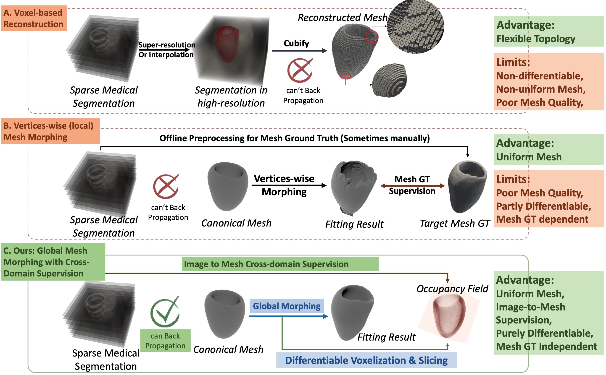
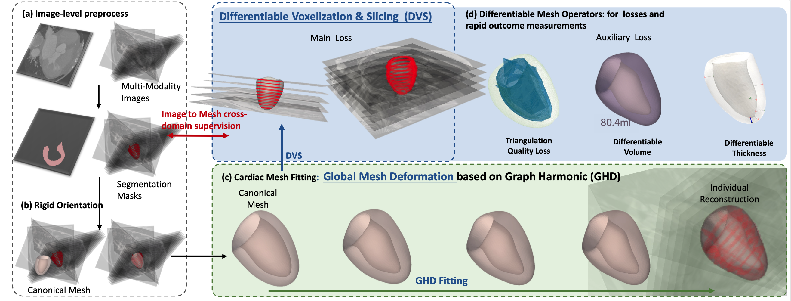

## GHDHeart
# Official Implementation

This repository contains the official implementation of our paper **[Explicit Differentiable Slicing and Global Deformation for Cardiac Mesh Reconstruction](https://arxiv.org/abs/2409.02070)** by Yihao Luo, Dario Sesia, Guang Yang, ChoonHwai Yap, et al., at Imperial College London. The code is released under the **MIT license**.



## What We Provide

When dealing with cardiac scanned data (MRI, CT, ultrasound, etc.), reconstructing the 3D mesh of the heart is a common challenge. Without a ground truth mesh, how can we achieve 3D optimization and reconstruction using only 2D slices for supervision? Our solution allows any loss designed for 2D slices to be directly used for 3D mesh optimization through the gradient back-propagation of **differentiable voxelization and slicing (DVS)**. Another key contribution is that we use **global harmonic deformation (GHD)** to model the cardiac shape which preserves the smoothness and mesh quality during optimization without extra regularization in losses. The proposed method is robust to sparse and can be applied to various datasets in different resolutions and modalities.

## News

- **2024-09**: The code is released.

## How to Use

### 1. Install Dependencies

```bash
conda create -n GHDHeart
conda activate GHDHeart
pip install -r requirements.txt
```
### 2. Quick Start
Run GHD fitting on the provided example data:

```bash
cd GHDHeart/Demo
python GHD_sparse_fitting.py --iter 1000 --target ES (or ED)
```
The code will load the example data and perform the optimization for 1000 iterations. The target phase can be set as 'ES' or 'ED'. The result meshes will be saved in the 'Demo/output' folder. The accuracy of the result can be evaluated by the Dice score printed in the console.


### 3. Demo & Tutorial

We provide notebooks for demos and tutorials. You can run the Jupyter notebooks in the 'Demo' folder to see how to use the code. The following figure demonstrates the pipeline of our method and how a 3D mesh morphs from the initial shape to fit the 2D slices (even sparse cross-plane slices). Run the demos to explore more!



For testing on multiple datasets, we provide data processing codes for several open datasets, including the [UK Biobank](https://www.ukbiobank.ac.uk/), [ACDC dataset](https://www.creatis.insa-lyon.fr/Challenge/acdc/), and [MM-WHS dataset and CCT48](https://zmiclab.github.io/zxh/0/mmwhs/). Please download the data from the original websites and organize the files as follows:

```
Dataset
├── UKBiobank
├── ACDC
│   ├── training
│   │   ├── patient001
│   │   ├── patient002
│   │   └── ...
│   └── testing
└── MMWHS
GHDHeart
└── Demo
    ├── GHD_sparse_fitting.ipynb 
    └── GHD_cardiac_fitting_dense_CT.ipynb 
```
User may get some fancy visualizations like this:
<div align=center></div>

## Beyond Cardiac Mesh Reconstruction

DVS is a general tool for 3D mesh optimization, applicable in many other fields. See the variation of DVS for general mesh optimization in [DOPH](https://github.com/Luo-Yihao/DOPH). DOPH is a differentiable tool for mesh to occupancy and mesh to SDF conversion with **GPU acceleration**. It can extract occupancy and SDF in **arbitrary resolution** in real-time, adaptive for **non-watertight (even completely open meshes)**, **non-manifold**, **self-intersecting**, and **combined** meshes.

## Citation

If you find our work useful in your research, please consider citing:

```
@misc{luo2024explicitdifferentiableslicingglobal,
      title={Explicit Differentiable Slicing and Global Deformation for Cardiac Mesh Reconstruction}, 
      author={Yihao Luo and Dario Sesia and Fanwen Wang and Yinzhe Wu and Wenhao Ding and Jiahao Huang and Fadong Shi and Anoop Shah and Amit Kaural and Jamil Mayet and Guang Yang and ChoonHwai Yap},
      year={2024},
      eprint={2409.02070},
      archivePrefix={arXiv},
      primaryClass={eess.IV},
      url={https://arxiv.org/abs/2409.02070}, 
}
@misc{luo2024differentiablevoxelizationmeshmorphing,
      title={Differentiable Voxelization and Mesh Morphing}, 
      author={Yihao Luo and Yikai Wang and Zhengrui Xiang and Yuliang Xiu and Guang Yang and ChoonHwai Yap},
      year={2024},
      eprint={2407.11272},
      archivePrefix={arXiv},
      primaryClass={cs.CV},
      url={https://arxiv.org/abs/2407.11272}, 
}
```